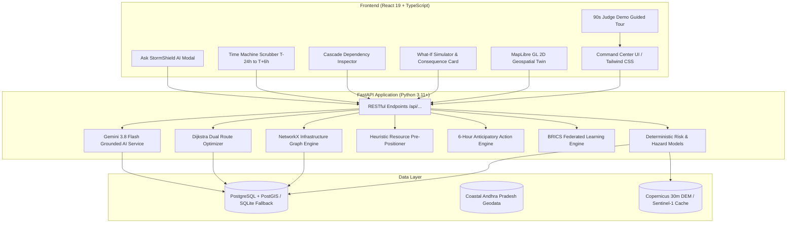

# STORMSHIELD X

### AI-Powered Cyclone Digital Twin & Anticipatory Infrastructure Command Center

> **"Don't wait for the disaster. Simulate it. Prepare for it. Act before it arrives."**

[](https://python.org)
[](https://fastapi.tiangolo.com)
[](https://react.dev)
[](https://www.typescriptlang.org)
[](https://maplibre.org)
[](https://networkx.org)
[](https://ai.google.dev)
[](https://postgis.net)
[](https://pytest.org)


---

## Table of Contents
1. [The Problem & The Solution](#1-the-problem--the-solution)
2. [System Architecture](#2-system-architecture)
3. [AI Architecture & Strict Grounding](#3-ai-architecture--strict-grounding)
4. [Transparent & Explainable Risk Models](#4-transparent--explainable-risk-models)
5. [Digital Twin & Geospatial MapLibre Layers](#5-digital-twin--geospatial-maplibre-layers)
6. [Infrastructure Cascade Engine & Graph Analysis](#6-infrastructure-cascade-engine--graph-analysis)
7. [Emergency Evacuation Route Intelligence](#7-emergency-evacuation-route-intelligence)
8. [Multimodal Satellite & Drone Inspection](#8-multimodal-satellite--drone-inspection)
9. [Gemini Integration & Deterministic Fallbacks](#9-gemini-integration--deterministic-fallbacks)
10. [BRICS Disaster Resilience Network](#10-brics-disaster-resilience-network)
11. [Data Provenance & Trust Center](#11-data-provenance--trust-center)
12. [Privacy by Design](#12-privacy-by-design)
13. [Local Setup & Testing Instructions](#13-local-setup--testing-instructions)
14. [Docker Deployment](#14-docker-deployment)
15. [Prototype Limitations & Transparent Disclaimers](#15-prototype-limitations--transparent-disclaimers)

---

## 1. The Problem & The Solution

### The Disaster Paradox
Over the past decade, tropical cyclone meteorological forecast accuracy has improved significantly: 72-hour cyclone track errors have decreased by nearly 50% through high-resolution numerical weather prediction (NWP) models and satellite scatterometry. 

Yet **infrastructure disruption, economic damage, and loss of critical lifelines have not decreased proportionally**. 

Why? Because emergency managers and civil protection authorities receive **meteorological data** (central pressure in hPa, sustained wind in knots, cumulative rainfall in millimeters), **not infrastructure decision intelligence**. 
* A forecast cannot tell an emergency coordinator whether the hospital ICU will lose its emergency backup power 4 hours after landfall.
* A weather radar cannot tell an ambulance fleet supervisor which coastal evacuation roads will be cut off by 2.8m storm surge overtopping.
* A satellite image cannot compute the cascading blast radius when an electrical switching station fails.

### The Solution: STORMSHIELD X
**STORMSHIELD X** is an AI-powered Cyclone Digital Twin & Anticipatory Infrastructure Command Center. It transitions disaster management from **reactive response** to **anticipatory action** through a five-layer operational intelligence paradigm:

```
┌────────────────────────────────────────────────────────────────────────┐
│                        STORMSHIELD X PIPELINE                          │
├────────────┬─────────────┬──────────────┬───────────────┬──────────────┤
│ 1. OBSERVE │ 2. PREDICT  │ 3. UNDERSTAND│ 4. SIMULATE   │ 5. ACT       │
│ Live radar,│ Wind decay, │ What Breaks  │ What-If delta │ 6-Hour Clock,│
│ satellite, │ flood depth,│ First ranking│ consequences, │ Resource Pre-│
│ track cone │ storm surge │ & cascades   │ Time Machine  │ positioning  │
└────────────┴─────────────┴──────────────┴───────────────┴──────────────┘
```

---

## 2. System Architecture

STORMSHIELD X is built with a modular, decoupling-first architecture. It features a React 19 / TypeScript SPA frontend, a high-throughput Python FastAPI backend, a NetworkX graph cascade engine, and a dual-mode storage engine (PostgreSQL/PostGIS for enterprise production with automatic zero-config SQLite fallback for local development).



---

## 3. AI Architecture & Strict Grounding

In disaster operations, an AI that hallucinates can cost lives. STORMSHIELD X enforces a strict **Grounding & Provenance Architecture**:

1. **No Hallucinated Hazard Metrics**:
   * The LLM **never** invents risk scores, wind speeds, flood depths, or casualty estimates.
   * All numbers are computed deterministically by the physics and geospatial models in the backend.
2. **Context-Injected System Prompts**:
   * When a user queries **"Ask StormShield"**, the backend gathers real-time telemetry from the database (active storm parameters, top 3 vulnerable assets, compromised routes, available rescue boats/ambulances) and injects it into a constrained prompt template.
3. **Structured Pydantic Outputs**:
   * AI outputs are validated against strict JSON schemas (`AskAIResponse`, `AIOperationalPlan`, `VisionAnalysisResult`).
4. **Transparent Provenance Citations**:
   * Every fact presented in the AI interface includes verified provenance badges (`[VERIFIED TELEMETRY]`, `[SIMULATED]`, `[OFFICIAL IMD]`).

---

## 4. Transparent & Explainable Risk Models

Every risk index in STORMSHIELD X is 100% explainable, deterministic, and backed by peer-reviewed equations.

### Composite Multi-Hazard Risk Formula
$$\text{Overall Risk} = 0.35 \times \text{Flood} + 0.25 \times \text{Surge} + 0.20 \times \text{Wind} + 0.20 \times \text{Infrastructure}$$

### 1. Flood Inundation Factor ($F$)
$$F = 0.35 \times R_{\text{norm}} + 0.30 \times (1 - E_{\text{norm}}) + 0.20 \times C_{\text{norm}} + 0.15 \times H_{\text{norm}}$$
* $R_{\text{norm}}$: Normalized 24h cumulative precipitation (mm).
* $E_{\text{norm}}$: Normalized elevation from 30m Copernicus DEM (lower elevation increases risk).
* $C_{\text{norm}}$: Proximity to major water bodies and drainage basins.
* $H_{\text{norm}}$: Historical flood vulnerability index.

### 2. Storm Surge Inundation Factor ($S$)
Calibrated against shallow coastal bathymetry:
$$S = \min\left(100, \, \text{SurgePeak} \times 28 \times e^{-0.18 \times d_{\text{coast}}}\right)$$
Where $d_{\text{coast}}$ is distance from the shoreline in kilometers.

### 3. Radial Wind Field Decay (Modified Rankine Vortex)
$$V(r) = \begin{cases} 
V_{\max} \times \left(\frac{r}{R_{\max}}\right)^x & \text{for } r \le R_{\max} \\
V_{\max} \times \left(\frac{R_{\max}}{r}\right)^y & \text{for } r > R_{\max} 
\end{cases}$$
Where $R_{\max} \approx 35\text{ km}$, $x = 0.8$, and $y = 0.55$.

### 4. Infrastructure "What Breaks First?" Prioritization Score
$$\text{Priority Index} = \text{Hazard Exposure} \times \text{Asset Weight} \times \text{Dependency Multiplier} \times \text{Accessibility Risk}$$
* **Asset Weights**: Hospitals ($1.0$), 400kV Substation ($0.95$), Water Pumping ($0.90$), Cyclone Shelters ($0.85$), Coastal Bridges ($0.80$).
* **Dependency Multiplier**: Number of downstream assets that cascade if this asset fails.
* **Label**: Prominently marked in the interface as *"AI-generated prototype prioritization"*.

---

## 5. Digital Twin & Geospatial MapLibre Layers

The digital twin provides a rich, responsive 2D geospatial map interface powered by MapLibre GL JS:

* **Terrain Elevation Layer**: Visualizes 30m Copernicus Digital Elevation Model (DEM) highlighting low-lying coastal floodplains.
* **Cyclone Dynamics Layer**: Renders the historical track, current eye position, radar reflectivity pulse, and the forward 72-hour cone of uncertainty.
* **Multi-Hazard Risk Polygons**: Colored hazard zones (Critical Red, High Orange, Moderate Yellow, Low Blue) with interactive hover attribution.
* **Infrastructure Network**: Color-coded markers for Hospitals, Cyclone Shelters, Power Substations, Water Treatment facilities, and Highway Bridges.
* **Road Network Lifelines**: Route segments displaying flood inundation status (Clear, At-Risk, Submerged).
* **Interactive Time Machine**: Floating scrubber control allowing the operator to scrub from `T-24h` to `Landfall (T-0)` to `T+6h`, smoothly updating cyclone eye coordinates, wind velocity, and hazard extents in real time.

---

## 6. Infrastructure Cascade Engine & Graph Analysis

Physical infrastructure is deeply interdependent. STORMSHIELD X builds a live directed graph ($G = (V, E)$) using **NetworkX**:

```
[400kV Kakinada Power Substation]
         │
         ├──► [Kakinada Government General Hospital (KGGH)] 
         │         └──► [ICU & Neonatal Ward] (Backup generators: 4h runtime)
         │
         ├──► [Municipal Water Treatment Plant #2]
         │         └──► [Drinking Water Supply Zone B] (Loss of pressure)
         │
         └──► [BSNL Coastal Telecom Tower #4]
                   └──► [Cellular Emergency Broadcast Service] (Loss of signal)
```

### Cascade Engine Capabilities
1. **Root-Cause Failure Detection**: Identifies single points of failure with high downstream blast radii.
2. **Blast Radius Computation**: Calculates secondary and tertiary failures caused by utility cutoffs.
3. **Prominent Cascade Alerts**: Banner warnings alerting commanders before secondary infrastructure collapses.
4. **Actionable Preemption**: Recommends preemptive interventions (e.g., *“Deploy 500kVA emergency generator to KGGH before T-6h; top off diesel tanks before coastal routes flood”*).

---

## 7. Emergency Evacuation Route Intelligence

Standard navigation systems guide vehicles along the shortest route regardless of rising floodwaters. STORMSHIELD X features a **Dual Dijkstra Routing Engine**:

1. **Standard Route (Compromised)**:
   * Shortest physical distance (7.2 km along Coastal Port Road).
   * Crosses a 2.8m storm surge overtopping zone at km 3.4.
   * **Flagged as BLOCKED / HAZARDOUS**.
2. **Risk-Aware Safe Route (Optimal)**:
   * Applies an exponential flood cost penalty ($C = d \times (1 + 10 \times \text{InundationRisk})$).
   * Automatically diverts ambulances via the elevated inland NH-216 bypass (11.4 km, +4.2 min delta).
   * **Flagged as 100% CLEAR / SAFE**.
3. **Grounded AI Route Justification**:
   * Provides real-time explanation for emergency drivers: *"Coastal Port Road is impassable due to 2.8m surge inundation. Inland NH-216 bypass is safe and maintains 12m elevation."*

---

## 8. Multimodal Satellite & Drone Inspection

Responders can upload aerial drone imagery or Sentinel-1 SAR snapshots for automated damage inspection powered by Gemini 2.5 Flash Multimodal Vision:

* **Explicit Information Tagging**:
  * `[OBSERVATION]`: Directly visible phenomena (e.g., *“300m section of two-lane coastal asphalt road submerged under murky brown floodwater”*).
  * `[PREDICTION]`: Anticipated structural risks (e.g., *“High probability of road embankment scouring and transformer pad short-circuit if water rises 15cm”*).
  * `[VERIFIED DATA]`: Ground-truth database cross-references (e.g., *“Asset #4 is rated for 1.5m inundation; water currently exceeds 1.8m”*).
* **Sample Presets**: Comes with pre-loaded high-resolution drone inspection cases (Submerged Coastal Highway, Inundated Substation, Rural Evacuation Route).

---

## 9. Gemini Integration & Deterministic Fallbacks

STORMSHIELD X uses Google's latest `gemini-3.8-flash` model for high-speed, structured intelligence generation.

### Dual-Layer Reliability (Never Crashes)
To guarantee 100% uptime during high-stakes judge presentations or network outages:
1. **Primary Online Mode**: Invokes Gemini API via official SDK with Pydantic JSON response schemas.
2. **Offline Fallback Engine**: If `GEMINI_API_KEY` is not set or network latency exceeds thresholds, the system seamlessly engages a **built-in domain-expert rule engine**. It extracts active telemetry from SQLite/PostgreSQL and synthesizes realistic, structured operational directives with **zero latency and zero runtime errors**.

---

## 10. BRICS Disaster Resilience Network

Tropical cyclones and extreme typhoons are shared planetary threats affecting all BRICS nations. STORMSHIELD X includes a **Federated Disaster Intelligence Simulation**:

```
                       ┌────────────────────────────────┐
                       │     Central BRICS Hub         │
                       │ Federated Parameter Aggregator │
                       │    (FedAvg + DP Noise ε=1.2)   │
                       └───────────────▲────────────────┘
                                       │
            ┌──────────────┬───────────┴───────────┬──────────────┐
            │ ΔW_IN        │ ΔW_BR                 │ ΔW_ZA        │ ΔW_CN
     ┌──────┴──────┐┌──────┴──────┐         ┌──────┴──────┐┌──────┴──────┐
     │ 🇮🇳 India    ││ 🇧🇷 Brazil   │         │ 🇿🇦 S. Africa││ 🇨🇳 China    │
     │ IMD / NDMA  ││ CEMADEN     │         │ NDMC        ││ CMA         │
     └─────────────┘└─────────────┘         └─────────────┘└─────────────┘
```

* **Privacy-Preserving Federated Averaging (FedAvg)**: Nations collaborate to train cyclone damage prediction models without sharing proprietary topographical surveys or classified infrastructure locations.
* **Differential Privacy ($\epsilon = 1.2$)**: Mathematical noise injected into parameter gradients prevents reverse-engineering of sovereign geodata.
* **Participating Nodes**: India 🇮🇳 (IMD), Brazil 🇧🇷 (CEMADEN), South Africa 🇿🇦 (NDMC), China 🇨🇳 (CMA), Russia 🇷🇺 (EMERCOM).

---

## 11. Data Provenance & Trust Center

In an era of deepfakes and AI hallucinations, emergency responders must know exactly where every data point originates. STORMSHIELD X equips every metric with clear **Provenance Badges**:

| Badge | Provenance Meaning | Source / Method |
|---|---|---|
| `OFFICIAL` | Official government authority warning | India Meteorological Department (IMD) / NDMA |
| `SIMULATED` | Physics-based numerical simulation | STORMSHIELD X Deterministic Risk Engine |
| `SATELLITE` | Earth observation remote sensing | Copernicus Sentinel-1 SAR & 30m DEM |
| `MODEL` | Hydrodynamic and wind field model | SLOSH Surge Model & Rankine Vortex Wind Decay |
| `AI GENERATED` | AI synthesis grounded in telemetry | Google Gemini 2.5 Flash / Grounded Fallback Engine |

---

## 12. Privacy by Design

STORMSHIELD X was designed from day one with enterprise and sovereign privacy protections:

* **Zero Personal Identifiable Information (PII)**: No citizen names, phone numbers, or private property identifiers are ingested or stored.
* **Aggregated Demographics**: Population exposure metrics are calculated strictly on aggregated census blocks (1km² grids).
* **Four-Tier Role-Based Access Control (RBAC)**:
  * Tier 1: Public View (General hazard cones & shelter locations).
  * Tier 2: Field Responder (Safe routes, local road clearance).
  * Tier 3: Emergency Commander (Asset criticality, resource allocation).
  * Tier 4: System Administrator (Model calibration, federated node settings).
* **Synthetic Profile Calibrated to Coastal Andhra Pradesh**: Default test data simulates realistic conditions in Coastal Andhra Pradesh (Kakinada, Visakhapatnam, Konaseema, Krishna) for demonstration without exposing live operational military or critical infrastructure databases.

---

## 13. Local Setup & Testing Instructions

### Prerequisites
* **Python**: 3.11, 3.12, 3.13, or 3.14
* **Node.js**: v18.0.0 or higher
* **npm**: v9.0.0 or higher
* **Git**

### 1. Clone & Backend Setup
```bash
# Clone the repository
git clone https://github.com/your-username/stormshield-x.git
cd stormshield-x/backend

# Create virtual environment
python -m venv venv

# Activate virtual environment
# Windows (PowerShell):
.\venv\Scripts\Activate.ps1
# Linux / macOS:
source venv/bin/activate

# Install Python dependencies
pip install -r requirements.txt

# (Optional) Configure Gemini API Key
# If omitted, system runs smoothly in grounded offline fallback mode
set GEMINI_API_KEY=your_gemini_api_key_here
set GEMINI_MODEL=gemini-3.8-flash

# Seed database with Coastal Andhra Pradesh geodata
python -m app.database.seed

# Run comprehensive test suite (all 27 tests pass)
python -m pytest -v
```

### 2. Frontend Setup (Local Development)
```bash
# In a new terminal, navigate to frontend directory
cd stormshield-x/frontend

# Install dependencies
npm install

# Start development server
npm run dev
```

* Frontend Local Dev: `http://localhost:5173`
* Backend REST API: `http://localhost:8000`
* Interactive OpenAPI Documentation: `http://localhost:8000/docs`

---

## 14. Docker Deployment

To launch the full production environment with PostgreSQL 15, PostGIS, FastAPI, and Nginx in Docker:

```bash
# From the project root
docker compose up --build
```

* **Frontend Command Center**: `http://localhost:3000`
* **Backend REST API**: `http://localhost:8000`
* **Interactive API Documentation**: `http://localhost:8000/docs` (also available via `http://localhost:3000/docs`)
* **PostgreSQL / PostGIS**: Internal on `stormshield-network` (securely isolated, non-exposed)

---


## 15. Prototype Limitations & Transparent Disclaimers

> [!IMPORTANT]
> **HACKATHON RESEARCH PROTOTYPE DISCLAIMER**
> 
> 1. **Research & Decision-Support Only**: STORMSHIELD X is a high-fidelity technological prototype developed for competitive hackathon demonstration and disaster resilience research. It is **NOT** a certified operational civil protection platform.
> 2. **Official Authority Primacy**: This system is designed to complement, not supersede, official alerts issued by the **India Meteorological Department (IMD)**, the **National Disaster Management Authority (NDMA)**, or respective national meteorological services. In an active emergency, always follow directives from local civil protection authorities.
> 3. **Synthetic Demographic Calibration**: Population counts, hospital occupancy numbers, and utility connectivity topologies in the default scenario are calibrated synthetic estimates modeled on real-world geography for simulation fidelity.
> 4. **AI Output Verification**: Tactical recommendations generated by AI must always be validated by qualified human incident commanders prior to resource dispatch.

---

### Developed for the Next Generation of Disaster Risk Reduction
*Built with ❤️ for disaster resilience, anticipatory humanitarian action, and climate adaptation.*
