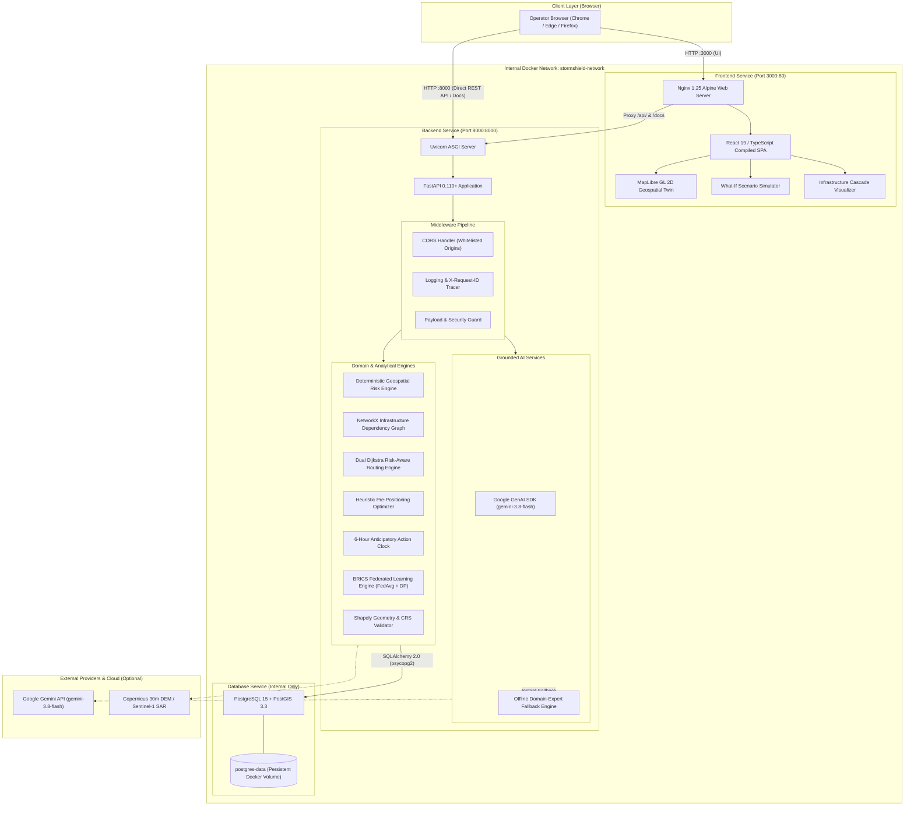

# STORMSHIELD X — SYSTEM ARCHITECTURE & PRODUCTION TOPOLOGY

**Platform**: STORMSHIELD X  
**Tagline**: *"Don't wait for the disaster. Simulate it. Prepare for it. Act before it arrives."*  
**Architecture Classification**: Microservice Disaster Digital Twin & Anticipatory Infrastructure Decision Support System  

---

## 1. High-Level Architecture Diagram

---

## 2. Component Breakdown

### 2.1 Frontend Container (`stormshield-frontend`)
* **Base Image**: Multi-stage build (`node:20-alpine` $\to$ `nginx:alpine`).
* **Port Mapping**: Host port `3000` $\to$ Container port `80`.
* **Static Asset Delivery**: Pre-compiled React 19 application minified with Vite and gzip-compressed by Nginx.
* **Reverse Proxy**: Nginx routes `/api/` traffic directly to `http://backend:8000/api/` and Swagger UI at `/docs` to `http://backend:8000/docs`.
* **Health Check**: `wget -q --spider http://localhost:80/` (Interval: 10s, Retries: 3).

### 2.2 Backend Container (`stormshield-backend`)
* **Base Image**: `python:3.11-slim` with compiled C libraries (`libgeos-dev`, `libpq-dev`, `build-essential`).
* **Port Mapping**: Host port `8000` $\to$ Container port `8000`.
* **Execution**: `uvicorn app.main:app --host 0.0.0.0 --port 8000`.
* **Resilient Startup**: Evaluates PostgreSQL connection readiness with retry loops before falling back to SQLite if PostgreSQL is unavailable.
* **Health Check**: `curl -f http://localhost:8000/api/health` (Interval: 10s, Retries: 5).

### 2.3 Database Container (`stormshield-postgres`)
* **Image**: `postgis/postgis:15-3.3`.
* **Network Isolation**: Accessible **only** within `stormshield-network` (port 5432 is not bound to the host, protecting sovereign infrastructure models).
* **Storage**: Persistent named volume `postgres-data`.
* **Schema Initialization**: Executes `schema.sql` on first boot, enabling `postgis` and creating spatial indexes.
* **Health Check**: `pg_isready -U postgres -d stormshield` (Interval: 5s, Retries: 5).

---

## 3. Core Engine Mathematical Foundations

### 3.1 Deterministic Multi-Hazard Risk Model
$$\text{Overall Risk} = 0.35 \times \text{Flood} + 0.25 \times \text{Surge} + 0.20 \times \text{Wind} + 0.20 \times \text{Infrastructure}$$

### 3.2 Dual Dijkstra Flood-Penalized Routing
For every road segment $e = (u, v)$ with distance $d(e)$ and flood risk $R_{\text{flood}}(e) \in [0, 100]$:
$$w_{\text{safe}}(e) = \begin{cases} 
\infty & \text{if } R_{\text{flood}}(e) \ge 85.0 \text{ (Completely Submerged)} \\
d(e) \times \left(1 + 10 \times \left(\frac{R_{\text{flood}}(e)}{100}\right)^2\right) & \text{otherwise}
\end{cases}$$

### 3.3 NetworkX Infrastructure Cascade Blast Radius
The directed dependency graph $G = (V, E)$ computes downstream blast radii using breadth-first traversal with a visited set $S$ to prevent infinite dependency cycles:
$$\text{BlastRadius}(v_{\text{root}}) = \bigcup_{k=1}^{\infty} \left\{ u \in V \mid \text{dist}_G(v_{\text{root}}, u) = k \right\}$$

---

## 4. Security & Data Governance Architecture
1. **Network Boundary**: PostgreSQL port 5432 is isolated to `stormshield-network`.
2. **CORS Governance**: Configurable origin whitelisting (`http://localhost:3000`, `http://localhost:5173`) without wildcard permits.
3. **Payload Inspection**: Uploaded drone/satellite imagery undergoes strict file extension verification, MIME type whitelisting, and magic signature byte validation.
4. **Credential Hygiene**: Zero credentials stored in code; all secrets injected via environment variables.
